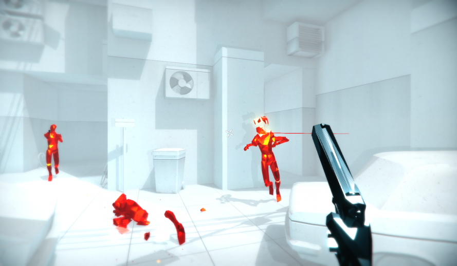
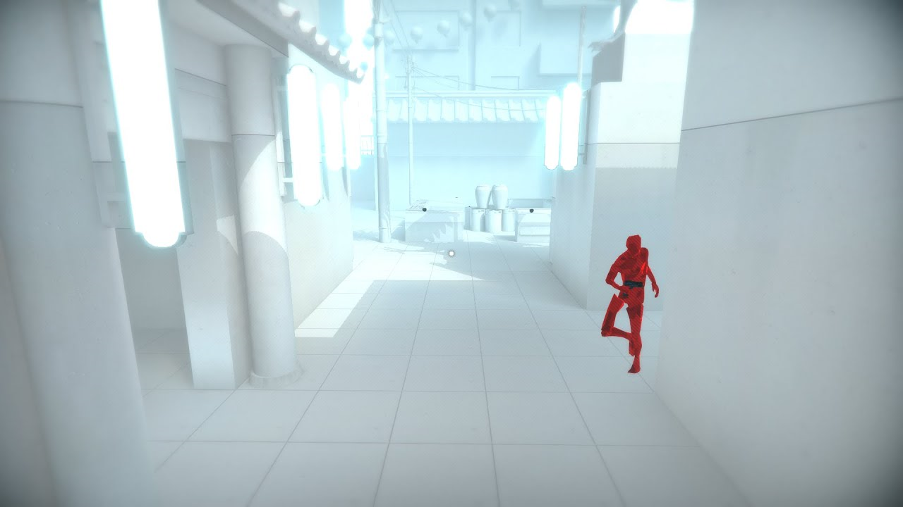
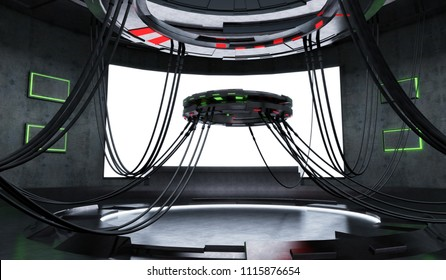
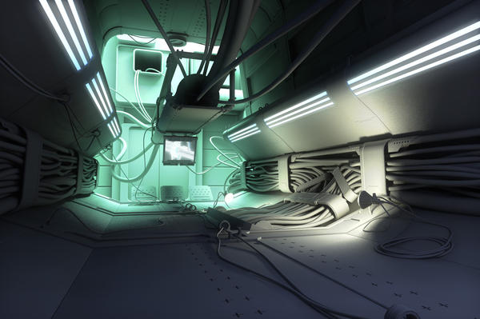
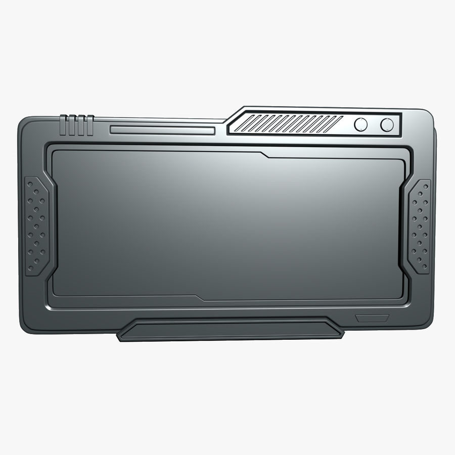
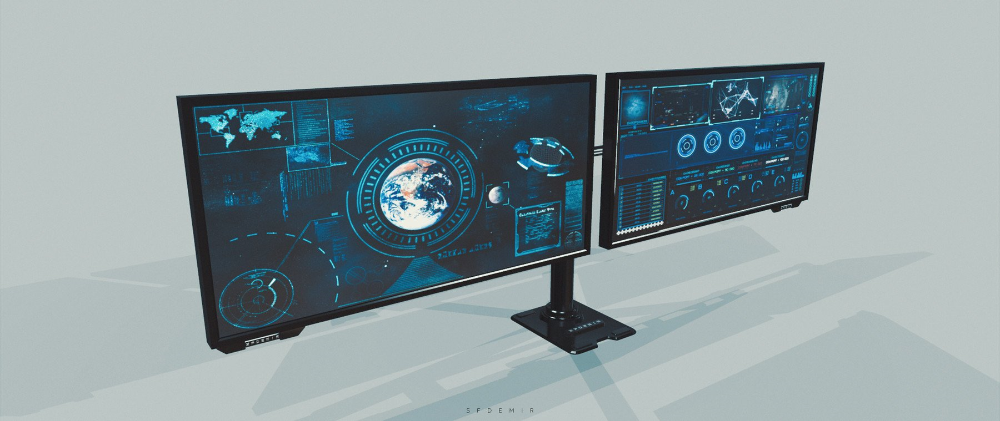

# Préproduction
> C'est ici qu'on dépose les éléments de la préproduction.

# Table des matières
1. [Intention ou concept](#Intention-ou-concept)
    - [Intention de départ](#Intention-de-départ)
    - [Synopsis](#Synopsis)
    - [Tableau d'ambiance (*moodboard*)](#Tableau-d'ambiance-(*moodboard*))
2. [Contenu multimédia à intégrer](#Contenu-multimédia-à-intégrer)
    - [Inventaire du contenu multimédia](#Inventaire-du-contenu-multimédia)
3. [Planification technique d'un prototype (devis technique)](#Planification-technique-(devis-technique))
    - [Schémas ou plans techniques](#Schémas-ou-plans-techniques)
    - [Matériaux requis](#Matériaux-de-scénographie-requis)
    - [Équipements requis](#Équipements-requis)
    - [Logiciels requis](#Logiciels-requis)
    - [Ressources humaines requises](#Ressources-humaines-requises)
    - [Ressources spatiales requises (rangement et locaux)](#Ressources-spatiales-requises-(rangement-et-locaux))
    - [Contraintes techniques et potentiels problèmes de production](#Contraintes-techniques-et-potentiels-problèmes-de-production)
4. [Planification de la production d'un prototype (budget et étapes de réalisation)](#Planification-de-la-production-(budget-et-étapes-de-réalisation))
    - [Budget prévisionnel](#Budget-prévisionnel)
    - [Échéancier global](#Échéancier-global)
    - [Liste des tâches à réaliser](#Liste-des-tâches-à-réaliser)
    - [Rôles et responsabilités des membres de l'équipe](#Rôles-et-responsabilités-des-membres-de-l'équipe))
    - [Moments des rencontres d'équipe](#Moments-des-rencontres-d'équipe)

# Intention ou concept

## Intention de départ
Par ce projet, nous souhaitons tester les connaissances de cinéma des élèves du secondaire en art multimédia.

## Synopsis
Les élèves sont apportés à choisir des modules posant des questions sur les leçons de cinéma qu'ils ont vu en classe. 

## Tableau d'ambiance (*moodboard*)

Transition de boites aux questions : https://store.steampowered.com/app/1768340/XPLORASI3D/

Environnement du style du jeu Superhot

Fil reliant les différents modules/TV pour les vidéos/questions

Inspirations de Module/TV futuristique pour les vidéos/questions

Typographie: Biome light

Palette de couleur: couleurs saturées, bleu, turquoise, violet

# Contenu multimédia à intégrer
## Inventaire du contenu multimédia

- 3 icônes de navigation (menu de départ pour les utilisateur-trices)
- 22 montages d'image (questions)
- 1 trame sonore (lorsqu'aucun module n'est activé)
- 22 vidéos d'animation 2D ou libre de droit
- 3 scènes 3d Unity

# Planification technique d'un prototype (devis technique)
## Schémas ou plans techniques

### Plantation 

Non requis (Seulement pour éléments en réel)

### Schéma de branchement 

Non requis (C'est un jeu en ligne)

## Matériel de scénographie requis

> Liste des matériaux de scénographie (matériaux de décor) requis ou lien vers un tableur Excel ou document Markdown à part si nécessaire (quantité, spécifications techniques, lien vers fiche technique si applicable, commentaires...)

Non requis (Aucune scène en réel)

## Équipements requis
> Liste des équipements requis par département ou lien vers un tableur Excel ou document Markdown à part si nécessaire (quantité, spécifications techniques, lien vers fiche technique si applicable, commentaires...)

* Audio
    * Une paire d'écouteur

* Vidéo
    * N/A

* Lumière
    * N/A

* Électricité
    * 1 Chargeur pour ordinateur portable

* Réseau
    * 1 fil Ethernet

* Ordinateur
    * 1 ordinateur portable 
    
* Autre
    * N/A

## Logiciels requis
> Liste des logiciels requis, version ainsi que leurs dépendences

* Maya (logiciel de création 3D)
* Unity (logiciel d'édition de scène 3D) 
* Visual Studio Code (logiciel d'édition de code)
* Premiere (logiciel d'édition de vidéo)

## Ressources humaines requises
> Formaté en liste ou en lien vers un tableur Excel.

* Marc-Olivier Lacroix, Maître de stage
* Marie-Michelle Ouellet, Superviseure de stage
* Guillaume Arsenault, Personne ressource

## Ressources spatiales requises (rangement et locaux)
> Spécifications des espaces nécessaires formaté en liste ou lien vers un tableur Excel.

N/A 

## Contraintes techniques et potentiels problèmes de production
> Tableau ou lien vers un tableur Excel (contraintes, problème et solution envisagée, commentaires...)

| Contrainte ou problème potentiel                 | Solution envisagée                                    | Commentaires                                                                                 |
|--------------------------------------------------|-------------------------------------------------------|----------------------------------------------------------------------------------------------|
| Hébergeur web non compatible | Trouver plusieurs hébergeurs possibles | N/A |
| Manquer de temps | Utiliser des vidéos libre de droit au lieu d'en créer | N/A |
| Changement de texture non réussi | Utiliser deux objets différents avec des filtres d'opacité | N/A |
| Difficulté en c# | Utiliser stackoverflow et w3school pour trouver des solutions | N/A |
| Modélisation non réussie | Utiliser des assets déjà créés libre de droit | N/A |
| Changement de scène non réussi | Téléportation dans la même scène | N/A |
| Trame musicale incomplète | Utiliser musique libre de droit comme trame de fond | N/A |

# Planification de la production d'un prototype (budget et étapes de réalisation)
## Budget prévisionnel

0$

## Échéancier global
Étapes importantes du projet visualisé dans GitHub (*milestones*):  
https://github.com/tim-montmorency/66B-modele_de_projet/milestones

*Dates importantes :*
- Première itération : lundi x novembre
- Prototype finale : lundi x décembre
- Présentation des projets devant public : jeudi 25 mars (soir)

## Liste des tâches à réaliser
Visualisation des tâches à réaliser dans GitHub selon la méthode Kanban:  
https://github.com/tim-montmorency/66B-modele_de_projet/projects/2?add_cards_query=is%3Aopen

Inventaire des tâches à réaliser dans GitHub selon le répertoire d'*issues*:  
https://github.com/tim-montmorency/66B-modele_de_projet/issues

## Rôles et responsabilités des membres de l'équipe
> Il vous est proposé ici de nommer une personne à la coordination générale du projet, à la coordination technique et à la coordination artistique. Les grandes décisions sur les grandes orientations du projet devraient se prendre en groupe lors de rencontres d'équipe. Cependant, les décisions entre vos rencontres de groupe devraient appartenir à ces personnes.

**Ghislain Lacombe**
-Création du projet

## Moments des rencontres d'équipe
Hebdomadaire
- **Vendredi 11:30** : Rencontre de suivi de projet avec la superviseure de stage.

Autre: 
- **"y" jour "x"h (1h-2h)** : Rencontre de suivi de projet le maître de stage.
